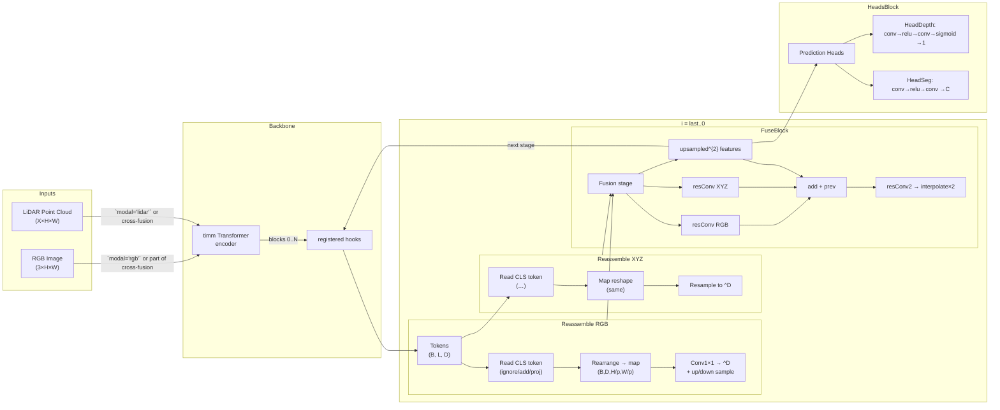

# System Architecture Overview

This document sketches the high‑level architecture of the **CLFT** model used in the repository. The diagram provides a mid‑level view that is suitable for both internal documentation and academic publications.

### Component details

- **Inputs:** RGB images (`3×H×W`) and LiDAR projections (`X×H×W`) enter the same transformer backbone. The `modal` argument selects which stream(s) to feed; cross‑fusion runs both and merges their activations later.
- **Transformer backbone:** A timm‑provided ViT/ResNet encoder produces a sequence of token vectors `(B, L, D)` per stream. Forward hooks are registered on specified transformer blocks (`hooks` list) to snapshot these activations.
- **Stage loop:** Hooks are processed from deepest to shallowest. Each activation tensor branches into two **Reassemble** paths:
  * **Read**: optionally incorporate the CLS token (ignored, averaged, or projected).
  * **Concat**: reshape token sequence to a spatial feature map of size `(B, D, H/p, W/p)` where `p` is the patch size.
  * **Resample**: a 1×1 conv followed by up‑ or down‑sampling (∆∈{½,1,2,4}) produces a map of dimension `^D`.
- **Fusion modules:** Corresponding RGB and XYZ maps are each processed by a ResidualConvUnit (two 3×3 convs with skip). Their outputs are summed with the previous-stage feature map, run through a third residual conv, and bilinearly interpolated by 2× to serve as input for the next (shallower) stage.
- **Heads:** After the last fusion, `HeadDepth` applies conv → interpolate → conv → ReLU → conv → sigmoid to reduce features to a single-channel depth map. `HeadSeg` uses a similar stack ending in `C` channels for class logits. Execution depends on the `type` argument (`full`, `depth`, `segmentation`).

> ✨ This sketch omits low‑level details (e.g. `Resample` internals) to remain human‑readable and focuses on the flow of data through the major blocks.
