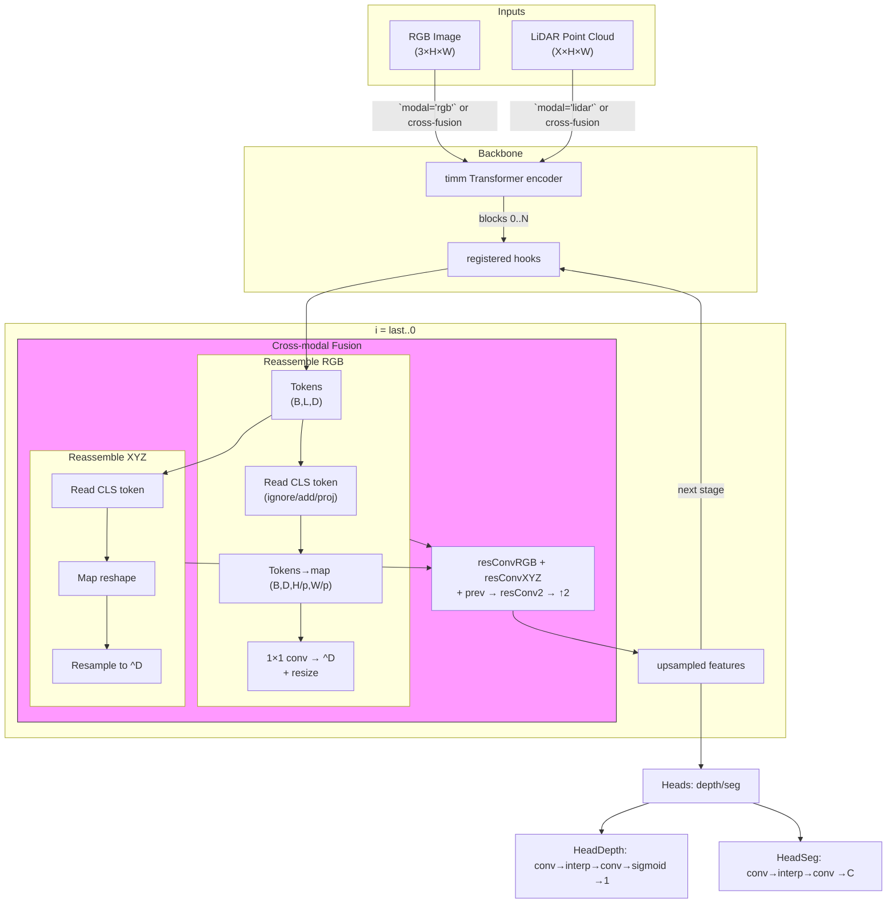

# CLFTv2 Architecture

This document sketches the high‑level architecture of the **CLFTv2** model used in the repository. It builds on the original CLFT design by making the cross‑fusion path explicit and clarifying the resampling operations in each reassembly block.

### Component details

- The **cross‑fusion block** is boxed to emphasize RGB/XYZ merger; its internals show residual convs on each branch, addition with previous features, a second residual conv, and bicubic upsampling.
- **Reassemble** subgraphs break down into three explicit operations (read, concat, resample) with token and spatial dimensions annotated, aiding reproducibility.
- The `Stage` loop now displays the activation tensor shape and the backward iteration over hook indices, clarifying data flow during the forward pass.
- Output heads detail the convolutional pipelines, including interpolation steps and final channel counts.

> Although richer, the diagram still abstracts away low‑level parameter choices and training shortcuts; it is intended for inclusion in a methods section of a journal paper where readers need an intermediate level of granularity.
