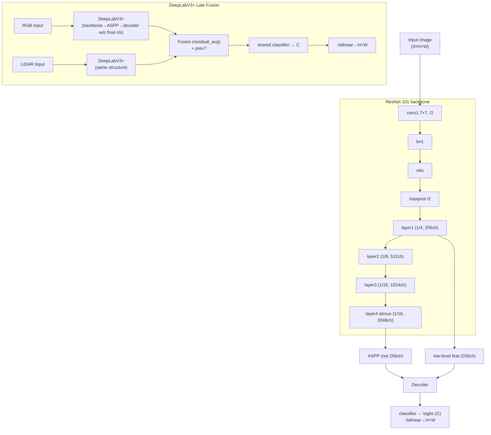

# DeepLabV3+ Implementation

This document sketches the high‑level architectures of the **DeepLabV3+** and **DeepLabV3+ Late Fusion** models used in the repository. The diagrams are detailed enough for inclusion in a methods section of a paper.

### Component details

- **Encoder:** Standard ResNet‑101 layers; `layer4` uses atrous convolutions (dilation=2) to maintain resolution. Spatial strides are \( /2, /4, /8, /16 \) respectively.
- **ASPP:** Atrous Spatial Pyramid Pooling with rates {1,6,12,18} plus global pooling; outputs 256‑channel feature map.
- **Decoder:** Projects low‑level `layer1` features to 48 channels, upsamples ASPP output to match, concatenates, runs two 3×3 convs with batch norm/RELU/dropout, then final classifier and bilinear upsampling to input size.
- **Late fusion:** Two parallel DeepLabV3+ pipelines (RGB and LiDAR). Final classifiers removed, features fused via simple average (plus optional previous-stage addition), then a shared 1×1 conv classifier produces segmentation logits. Individual branch predictions are also computed for diagnostics.

> This figure abstracts away weight initialisation, batch‑norm details, and training hyperparameters. It is intended to communicate structural design to readers and collaborators.
