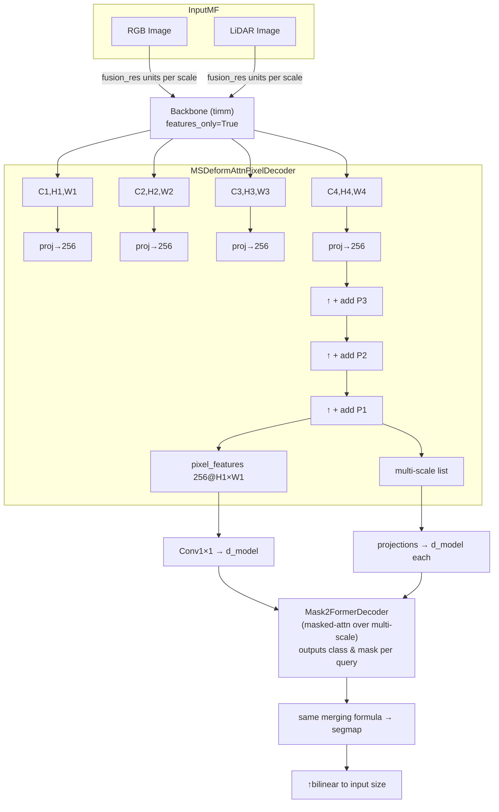

# Mask2FormerFusion Architecture

This document sketches the high‑level architecture of the **Mask2FormerFusion** model used in the repository. The figure highlights the deformable‑attention pixel decoder and multi‑scale masked‑attention transformer.

**Notes:**
- Fusion_res units apply a residual conv to each backbone output before elementwise addition.
- Pixel decoder is the deformable-attention variant from the official Mask2Former code; it produces both `pixel_features` and a multi-scale feature list used by the decoder.
- A simple 1×1 projection aligns channels to the transformer embedding dimension `d_model`.
- The Mask2Former decoder uses masked attention across scales and returns deep-supervision outputs.

> This file stands alone for clarity when discussing the Mask2Former design; see `MaskFormer.md` for the original MaskFormer architecture.