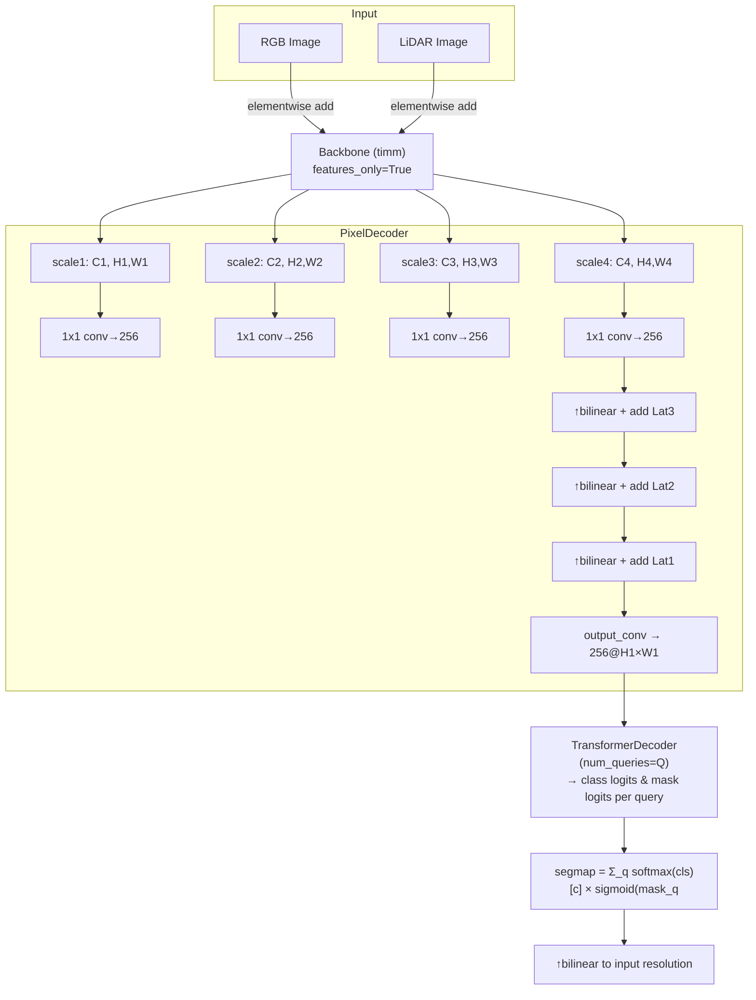

# MaskFormerFusion Architecture

This document sketches the high‑level architecture of the **MaskFormerFusion** model used in the repository. The diagram emphasises the multi‑scale backbone, pixel decoder, query‑based transformer, and early fusion strategy.

## MaskFormerFusion

**Notes:**
- Backbone outputs are lists of feature maps at progressively coarser resolutions.
- Early fusion (RGB + LiDAR) is performed immediately after the backbone.
- Pixel decoder reduces multi-scale maps to a single high-resolution feature map.
- Transformer decoder uses a fixed set of learnable query embeddings to predict class scores and masks; deep supervision returns outputs from all decoder layers.
- Inference merges query predictions using the MaskFormer formula into a dense segmentation map.

